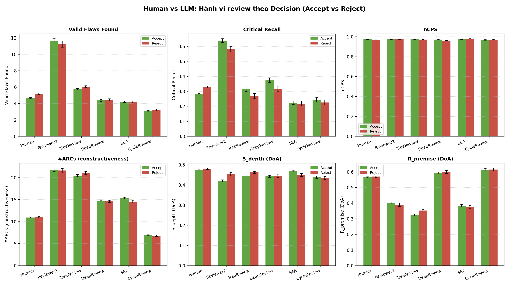
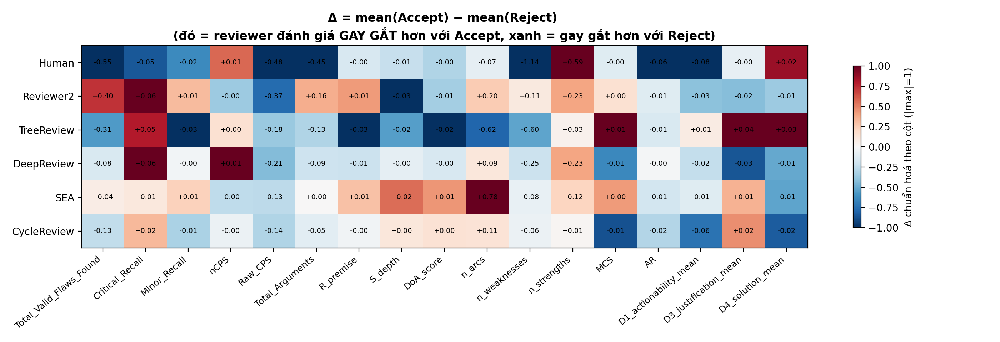
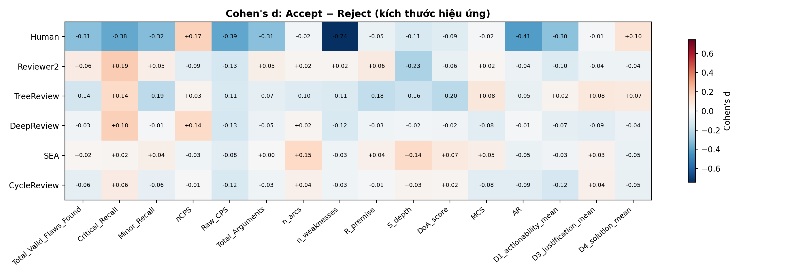
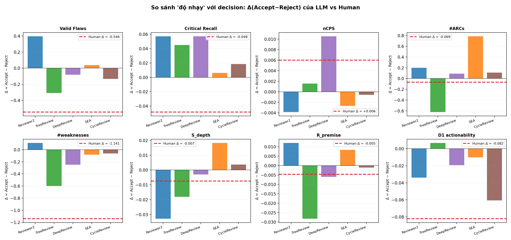

# Phân tích hành vi review: Human vs LLM theo Decision (Accept / Reject)

## 0. Tóm tắt nhanh — 3 phát hiện lớn nhất

1. **Human review có "decision bias" rất rõ; LLM review thì gần như không.**
   Với paper sau này được **accept**, human:
   - liệt kê **ít weakness hơn rõ rệt** (Δ = −1.14 điểm, Cohen's d = **−0.74**),
   - **nhấn mạnh strength nhiều hơn** (Δ = +0.59, d = **+0.48**),
   - tìm **ít valid flaw hơn** (Δ = −0.55, d = −0.31),
   - cho điểm **Raw_CPS (độ "gay gắt" của phê bình) thấp hơn** (d = −0.39),
   - dùng **tone lịch sự hơn** (D5_tone d = +0.38).

   Ngược lại, mọi LLM (Reviewer2, TreeReview, DeepReview, SEA, CycleReview) đều có
   |Cohen's d| ≤ 0.15 trên phần lớn các metric này → LLM **đối xử với paper
   Accept và Reject gần như giống hệt nhau**.

2. **Một số LLM còn đi NGƯỢC chiều human.**
   Ví dụ Reviewer2 tìm **NHIỀU flaw hơn** ở paper được accept (+0.40 vs human
   −0.55). Reviewer2, TreeReview, DeepReview đều cho **Critical_Recall cao hơn**
   trên Accept (+0.05 … +0.06), trong khi human thấp hơn (−0.05). Nguyên nhân
   hợp lý: LLM luôn "săn flaw" đều tay, còn GT flaw set của paper accept thường
   nhỏ hơn → tỉ lệ match lại cao hơn một cách máy móc.

3. **DoA (cấu trúc lập luận) và MCS / nCPS (điểm constructiveness/critical đã
   normalize) gần như bất biến theo decision.** Đây là các feature "phong cách"
   của người/mô hình, không phải tín hiệu chất lượng paper — phù hợp với các
   kết quả main result trước đây (Human có S_depth cao nhất, Reviewer2 có nCPS
   cao nhất, v.v.).

**Hệ quả đối với benchmark**: hành vi phê bình của LLM **ít bị "nhiễm" bởi
outcome** hơn con người. Nếu ta muốn reviewer công bằng giữa paper tốt / xấu,
LLM hiện tại đã rất ổn định. Nhưng nếu ta lấy reviewer human làm chân lý để
evaluate LLM (ví dụ đo recall flaw với GT từ human), LLM sẽ bị "thiệt" nhiều
hơn trên paper Reject, vì ở đó chính human đã khắt khe hơn.

---

## 1. Dữ liệu

- 5 hội nghị: iclr2024, iclr2025, iclr2026, icml2025, neurips2025.
- Mỗi hội nghị có 200 paper; decision được lấy từ `metadata.decision` trong `Human/Constructiveness/*/all_results_lite.jsonl` (mọi giá trị bắt đầu bằng "Accept" → Accept, còn lại → Reject).
- 5 LLM baseline: Reviewer2, TreeReview, DeepReview, SEA, CycleReview; và Human (trung bình các reviewer Human_1..Human_6).

### Phân phối paper theo decision

| conference   |   Accept |   Reject |
|:-------------|---------:|---------:|
| iclr2024     |      146 |       54 |
| iclr2025     |      128 |       72 |
| iclr2026     |      106 |       94 |
| icml2025     |      148 |       52 |
| neurips2025  |      150 |       50 |

## 2. Bảng tổng hợp (mean ± std, n papers) theo reviewer × decision

### Total_Valid_Flaws_Found
| reviewer_type   | Accept                 | Reject                 |
|:----------------|:-----------------------|:-----------------------|
| human           | 4.652 ± 1.757 (n=678)  | 5.198 ± 1.719 (n=321)  |
| reviewer2       | 11.642 ± 6.769 (n=676) | 11.246 ± 6.905 (n=321) |
| tree            | 5.750 ± 2.302 (n=677)  | 6.059 ± 2.191 (n=321)  |
| deepreview      | 4.366 ± 3.133 (n=677)  | 4.449 ± 2.409 (n=321)  |
| sea             | 4.229 ± 2.469 (n=678)  | 4.190 ± 1.970 (n=321)  |
| cyclereview     | 3.082 ± 2.186 (n=631)  | 3.217 ± 1.866 (n=300)  |

### Critical_Recall
| reviewer_type   | Accept                | Reject                |
|:----------------|:----------------------|:----------------------|
| human           | 0.282 ± 0.130 (n=665) | 0.330 ± 0.123 (n=317) |
| reviewer2       | 0.638 ± 0.304 (n=556) | 0.581 ± 0.305 (n=290) |
| tree            | 0.314 ± 0.334 (n=499) | 0.269 ± 0.286 (n=262) |
| deepreview      | 0.375 ± 0.343 (n=498) | 0.318 ± 0.283 (n=287) |
| sea             | 0.225 ± 0.275 (n=470) | 0.219 ± 0.265 (n=267) |
| cyclereview     | 0.244 ± 0.310 (n=443) | 0.225 ± 0.268 (n=250) |

### Minor_Recall
| reviewer_type   | Accept                | Reject                |
|:----------------|:----------------------|:----------------------|
| human           | 0.246 ± 0.054 (n=678) | 0.264 ± 0.062 (n=321) |
| reviewer2       | 0.463 ± 0.176 (n=675) | 0.454 ± 0.184 (n=321) |
| tree            | 0.319 ± 0.146 (n=675) | 0.348 ± 0.153 (n=321) |
| deepreview      | 0.231 ± 0.152 (n=676) | 0.231 ± 0.143 (n=321) |
| sea             | 0.249 ± 0.153 (n=677) | 0.243 ± 0.139 (n=321) |
| cyclereview     | 0.182 ± 0.141 (n=630) | 0.191 ± 0.145 (n=300) |

### nCPS
| reviewer_type   | Accept                | Reject                |
|:----------------|:----------------------|:----------------------|
| human           | 0.974 ± 0.039 (n=678) | 0.968 ± 0.027 (n=321) |
| reviewer2       | 0.974 ± 0.050 (n=676) | 0.978 ± 0.030 (n=321) |
| tree            | 0.973 ± 0.069 (n=677) | 0.971 ± 0.046 (n=321) |
| deepreview      | 0.972 ± 0.080 (n=677) | 0.961 ± 0.057 (n=321) |
| sea             | 0.976 ± 0.093 (n=678) | 0.979 ± 0.044 (n=321) |
| cyclereview     | 0.970 ± 0.118 (n=631) | 0.971 ± 0.076 (n=300) |

### Raw_CPS
| reviewer_type   | Accept                | Reject                |
|:----------------|:----------------------|:----------------------|
| human           | 4.031 ± 1.243 (n=678) | 4.508 ± 1.228 (n=321) |
| reviewer2       | 8.276 ± 2.828 (n=676) | 8.643 ± 2.731 (n=321) |
| tree            | 4.331 ± 1.598 (n=677) | 4.509 ± 1.500 (n=321) |
| deepreview      | 3.440 ± 1.534 (n=677) | 3.646 ± 1.600 (n=321) |
| sea             | 3.452 ± 1.607 (n=678) | 3.577 ± 1.622 (n=321) |
| cyclereview     | 2.794 ± 1.254 (n=631) | 2.938 ± 1.246 (n=300) |

### Total_Arguments
| reviewer_type   | Accept                 | Reject                |
|:----------------|:-----------------------|:----------------------|
| human           | 4.640 ± 1.491 (n=678)  | 5.087 ± 1.361 (n=321) |
| reviewer2       | 10.065 ± 3.546 (n=676) | 9.903 ± 3.369 (n=321) |
| tree            | 5.360 ± 1.861 (n=677)  | 5.495 ± 1.763 (n=321) |
| deepreview      | 4.009 ± 2.023 (n=677)  | 4.103 ± 2.115 (n=321) |
| sea             | 3.981 ± 2.021 (n=678)  | 3.978 ± 1.968 (n=321) |
| cyclereview     | 3.158 ± 1.591 (n=631)  | 3.207 ± 1.425 (n=300) |

### R_premise
| reviewer_type   | Accept                | Reject                |
|:----------------|:----------------------|:----------------------|
| human           | 0.565 ± 0.095 (n=678) | 0.570 ± 0.091 (n=322) |
| reviewer2       | 0.402 ± 0.181 (n=677) | 0.390 ± 0.197 (n=321) |
| tree            | 0.324 ± 0.159 (n=678) | 0.352 ± 0.152 (n=322) |
| deepreview      | 0.594 ± 0.177 (n=671) | 0.600 ± 0.178 (n=322) |
| sea             | 0.384 ± 0.215 (n=678) | 0.376 ± 0.200 (n=322) |
| cyclereview     | 0.614 ± 0.192 (n=678) | 0.615 ± 0.172 (n=322) |

### S_depth
| reviewer_type   | Accept                | Reject                |
|:----------------|:----------------------|:----------------------|
| human           | 0.473 ± 0.067 (n=678) | 0.480 ± 0.062 (n=322) |
| reviewer2       | 0.420 ± 0.143 (n=677) | 0.453 ± 0.135 (n=321) |
| tree            | 0.444 ± 0.122 (n=678) | 0.462 ± 0.099 (n=322) |
| deepreview      | 0.443 ± 0.136 (n=671) | 0.446 ± 0.141 (n=322) |
| sea             | 0.468 ± 0.123 (n=678) | 0.450 ± 0.136 (n=322) |
| cyclereview     | 0.439 ± 0.139 (n=678) | 0.435 ± 0.129 (n=322) |

### DoA_score
| reviewer_type   | Accept                | Reject                |
|:----------------|:----------------------|:----------------------|
| human           | 0.268 ± 0.054 (n=678) | 0.273 ± 0.056 (n=322) |
| reviewer2       | 0.168 ± 0.095 (n=677) | 0.174 ± 0.103 (n=321) |
| tree            | 0.148 ± 0.083 (n=678) | 0.164 ± 0.082 (n=322) |
| deepreview      | 0.264 ± 0.109 (n=671) | 0.267 ± 0.111 (n=322) |
| sea             | 0.187 ± 0.106 (n=678) | 0.180 ± 0.098 (n=322) |
| cyclereview     | 0.269 ± 0.114 (n=678) | 0.267 ± 0.106 (n=322) |

### n_arcs
| reviewer_type   | Accept                 | Reject                 |
|:----------------|:-----------------------|:-----------------------|
| human           | 10.923 ± 3.080 (n=678) | 10.992 ± 2.973 (n=322) |
| reviewer2       | 21.792 ± 9.804 (n=678) | 21.593 ± 8.630 (n=322) |
| tree            | 20.447 ± 6.668 (n=678) | 21.071 ± 5.907 (n=322) |
| deepreview      | 14.686 ± 4.819 (n=671) | 14.596 ± 4.998 (n=322) |
| sea             | 15.338 ± 5.405 (n=678) | 14.553 ± 5.328 (n=322) |
| cyclereview     | 6.917 ± 3.104 (n=678)  | 6.807 ± 2.862 (n=322)  |

### n_weaknesses
| reviewer_type   | Accept                | Reject                |
|:----------------|:----------------------|:----------------------|
| human           | 3.454 ± 1.434 (n=678) | 4.594 ± 1.726 (n=322) |
| reviewer2       | 9.301 ± 5.989 (n=678) | 9.189 ± 5.608 (n=322) |
| tree            | 8.201 ± 5.610 (n=678) | 8.801 ± 5.587 (n=322) |
| deepreview      | 3.928 ± 2.076 (n=671) | 4.177 ± 2.315 (n=322) |
| sea             | 3.959 ± 2.286 (n=678) | 4.040 ± 2.504 (n=322) |
| cyclereview     | 3.490 ± 1.852 (n=678) | 3.553 ± 1.734 (n=322) |

### n_strengths
| reviewer_type   | Accept                | Reject                |
|:----------------|:----------------------|:----------------------|
| human           | 3.119 ± 1.300 (n=678) | 2.531 ± 1.078 (n=322) |
| reviewer2       | 3.721 ± 2.926 (n=678) | 3.488 ± 2.457 (n=322) |
| tree            | 2.945 ± 2.581 (n=678) | 2.919 ± 2.385 (n=322) |
| deepreview      | 2.410 ± 1.545 (n=671) | 2.180 ± 1.459 (n=322) |
| sea             | 4.320 ± 2.832 (n=678) | 4.196 ± 2.770 (n=322) |
| cyclereview     | 0.024 ± 0.265 (n=678) | 0.012 ± 0.223 (n=322) |

### MCS
| reviewer_type   | Accept                | Reject                |
|:----------------|:----------------------|:----------------------|
| human           | 0.565 ± 0.076 (n=678) | 0.567 ± 0.064 (n=322) |
| reviewer2       | 0.576 ± 0.104 (n=590) | 0.574 ± 0.110 (n=289) |
| tree            | 0.489 ± 0.128 (n=657) | 0.479 ± 0.117 (n=316) |
| deepreview      | 0.631 ± 0.085 (n=664) | 0.638 ± 0.087 (n=317) |
| sea             | 0.499 ± 0.092 (n=675) | 0.495 ± 0.094 (n=321) |
| cyclereview     | 0.524 ± 0.110 (n=672) | 0.533 ± 0.112 (n=319) |

### AR
| reviewer_type   | Accept                | Reject                |
|:----------------|:----------------------|:----------------------|
| human           | 0.705 ± 0.160 (n=678) | 0.766 ± 0.122 (n=322) |
| reviewer2       | 0.782 ± 0.170 (n=590) | 0.790 ± 0.179 (n=289) |
| tree            | 0.771 ± 0.180 (n=657) | 0.780 ± 0.160 (n=316) |
| deepreview      | 0.835 ± 0.128 (n=664) | 0.836 ± 0.125 (n=317) |
| sea             | 0.628 ± 0.232 (n=675) | 0.639 ± 0.237 (n=321) |
| cyclereview     | 0.898 ± 0.218 (n=672) | 0.916 ± 0.195 (n=319) |

### D1_actionability_mean
| reviewer_type   | Accept                | Reject                |
|:----------------|:----------------------|:----------------------|
| human           | 1.077 ± 0.285 (n=678) | 1.160 ± 0.232 (n=322) |
| reviewer2       | 1.167 ± 0.330 (n=590) | 1.200 ± 0.358 (n=289) |
| tree            | 1.047 ± 0.287 (n=657) | 1.040 ± 0.250 (n=316) |
| deepreview      | 1.408 ± 0.295 (n=664) | 1.427 ± 0.294 (n=317) |
| sea             | 0.900 ± 0.402 (n=675) | 0.911 ± 0.414 (n=321) |
| cyclereview     | 1.308 ± 0.498 (n=672) | 1.369 ± 0.487 (n=319) |

### D3_justification_mean
| reviewer_type   | Accept                | Reject                |
|:----------------|:----------------------|:----------------------|
| human           | 0.763 ± 0.263 (n=678) | 0.766 ± 0.240 (n=322) |
| reviewer2       | 0.934 ± 0.439 (n=590) | 0.950 ± 0.418 (n=289) |
| tree            | 0.652 ± 0.481 (n=657) | 0.614 ± 0.441 (n=316) |
| deepreview      | 0.570 ± 0.362 (n=664) | 0.602 ± 0.390 (n=317) |
| sea             | 0.470 ± 0.410 (n=675) | 0.457 ± 0.401 (n=321) |
| cyclereview     | 0.330 ± 0.440 (n=672) | 0.313 ± 0.430 (n=319) |

### D4_solution_mean
| reviewer_type   | Accept                | Reject                |
|:----------------|:----------------------|:----------------------|
| human           | 0.480 ± 0.227 (n=678) | 0.459 ± 0.192 (n=322) |
| reviewer2       | 0.263 ± 0.260 (n=590) | 0.273 ± 0.241 (n=289) |
| tree            | 0.367 ± 0.357 (n=657) | 0.341 ± 0.338 (n=316) |
| deepreview      | 0.780 ± 0.287 (n=664) | 0.793 ± 0.297 (n=317) |
| sea             | 0.365 ± 0.283 (n=675) | 0.378 ± 0.275 (n=321) |
| cyclereview     | 0.394 ± 0.379 (n=672) | 0.415 ± 0.404 (n=319) |

### D5_tone_mean
| reviewer_type   | Accept                | Reject                |
|:----------------|:----------------------|:----------------------|
| human           | 1.618 ± 0.212 (n=678) | 1.539 ± 0.196 (n=322) |
| reviewer2       | 1.603 ± 0.436 (n=590) | 1.554 ± 0.490 (n=289) |
| tree            | 1.289 ± 0.602 (n=657) | 1.256 ± 0.592 (n=316) |
| deepreview      | 1.725 ± 0.285 (n=664) | 1.729 ± 0.295 (n=317) |
| sea             | 1.597 ± 0.245 (n=675) | 1.583 ± 0.256 (n=321) |
| cyclereview     | 1.315 ± 0.412 (n=672) | 1.332 ± 0.408 (n=319) |

## 3. Độ nhạy Δ = mean(Accept) − mean(Reject)

Δ>0 ⇒ reviewer cho điểm metric này CAO hơn với paper được accept (và ngược lại). Ta kỳ vọng human sẽ tìm ÍT flaw hơn & viết NHIỀU điểm mạnh hơn cho paper sẽ accept; LLM có replicate pattern đó không?

| metric                  |   human |   reviewer2 |   tree |   deepreview |    sea |   cyclereview |
|:------------------------|--------:|------------:|-------:|-------------:|-------:|--------------:|
| Total_Valid_Flaws_Found |  -0.546 |       0.396 | -0.309 |       -0.082 |  0.039 |        -0.134 |
| Critical_Recall         |  -0.048 |       0.057 |  0.045 |        0.057 |  0.006 |         0.018 |
| Minor_Recall            |  -0.018 |       0.009 | -0.029 |       -0.001 |  0.007 |        -0.009 |
| nCPS                    |   0.006 |      -0.004 |  0.002 |        0.011 | -0.003 |        -0.001 |
| Raw_CPS                 |  -0.477 |      -0.367 | -0.178 |       -0.206 | -0.125 |        -0.145 |
| Total_Arguments         |  -0.447 |       0.162 | -0.135 |       -0.094 |  0.003 |        -0.048 |
| R_premise               |  -0.005 |       0.012 | -0.028 |       -0.006 |  0.008 |        -0.001 |
| S_depth                 |  -0.007 |      -0.033 | -0.018 |       -0.003 |  0.018 |         0.004 |
| DoA_score               |  -0.005 |      -0.006 | -0.016 |       -0.003 |  0.007 |         0.002 |
| n_arcs                  |  -0.069 |       0.199 | -0.625 |        0.089 |  0.785 |         0.11  |
| n_weaknesses            |  -1.141 |       0.111 | -0.601 |       -0.249 | -0.082 |        -0.063 |
| n_strengths             |   0.588 |       0.234 |  0.026 |        0.23  |  0.124 |         0.011 |
| MCS                     |  -0.001 |       0.002 |  0.01  |       -0.007 |  0.004 |        -0.009 |
| AR                      |  -0.061 |      -0.007 | -0.009 |       -0.001 | -0.011 |        -0.018 |
| D1_actionability_mean   |  -0.082 |      -0.034 |  0.007 |       -0.019 | -0.01  |        -0.061 |
| D3_justification_mean   |  -0.003 |      -0.016 |  0.038 |       -0.032 |  0.013 |         0.017 |
| D4_solution_mean        |   0.022 |      -0.009 |  0.025 |       -0.013 | -0.013 |        -0.021 |
| D5_tone_mean            |   0.079 |       0.048 |  0.033 |       -0.004 |  0.015 |        -0.017 |

## 4. Cohen's d (kích thước hiệu ứng giữa Accept vs Reject)

| metric                  |   human |   reviewer2 |   tree |   deepreview |    sea |   cyclereview |
|:------------------------|--------:|------------:|-------:|-------------:|-------:|--------------:|
| Total_Valid_Flaws_Found |  -0.313 |       0.058 | -0.136 |       -0.028 |  0.017 |        -0.064 |
| Critical_Recall         |  -0.378 |       0.187 |  0.142 |        0.177 |  0.023 |         0.063 |
| Minor_Recall            |  -0.32  |       0.05  | -0.192 |       -0.006 |  0.044 |        -0.063 |
| nCPS                    |   0.17  |      -0.086 |  0.025 |        0.143 | -0.033 |        -0.005 |
| Raw_CPS                 |  -0.385 |      -0.131 | -0.113 |       -0.132 | -0.078 |        -0.116 |
| Total_Arguments         |  -0.308 |       0.046 | -0.074 |       -0.046 |  0.001 |        -0.031 |
| R_premise               |  -0.049 |       0.065 | -0.18  |       -0.034 |  0.04  |        -0.006 |
| S_depth                 |  -0.114 |      -0.234 | -0.158 |       -0.022 |  0.143 |         0.027 |
| DoA_score               |  -0.091 |      -0.057 | -0.199 |       -0.024 |  0.071 |         0.021 |
| n_arcs                  |  -0.023 |       0.021 | -0.097 |        0.018 |  0.146 |         0.036 |
| n_weaknesses            |  -0.743 |       0.019 | -0.107 |       -0.115 | -0.035 |        -0.035 |
| n_strengths             |   0.477 |       0.084 |  0.01  |        0.151 |  0.044 |         0.044 |
| MCS                     |  -0.017 |       0.015 |  0.082 |       -0.077 |  0.047 |        -0.08  |
| AR                      |  -0.413 |      -0.043 | -0.052 |       -0.01  | -0.048 |        -0.086 |
| D1_actionability_mean   |  -0.305 |      -0.1   |  0.024 |       -0.066 | -0.025 |        -0.123 |
| D3_justification_mean   |  -0.012 |      -0.037 |  0.08  |       -0.087 |  0.032 |         0.04  |
| D4_solution_mean        |   0.101 |      -0.036 |  0.072 |       -0.044 | -0.048 |        -0.054 |
| D5_tone_mean            |   0.383 |       0.106 |  0.055 |       -0.015 |  0.059 |        -0.041 |

## 5. Điểm chính tự động rút ra

- **Số flaw hợp lệ tìm được** — Human: Δ = -0.546 (d=-0.31). Reviewer2 Δ=+0.396 (d=+0.06); TreeReview Δ=-0.309 (d=-0.14); DeepReview Δ=-0.082 (d=-0.03); SEA Δ=+0.039 (d=+0.02); CycleReview Δ=-0.134 (d=-0.06)
- **Recall với critical flaw** — Human: Δ = -0.048 (d=-0.38). Reviewer2 Δ=+0.057 (d=+0.19); TreeReview Δ=+0.045 (d=+0.14); DeepReview Δ=+0.057 (d=+0.18); SEA Δ=+0.006 (d=+0.02); CycleReview Δ=+0.018 (d=+0.06)
- **nCPS (điểm phê bình chuẩn hoá)** — Human: Δ = +0.006 (d=+0.17). Reviewer2 Δ=-0.004 (d=-0.09); TreeReview Δ=+0.002 (d=+0.03); DeepReview Δ=+0.011 (d=+0.14); SEA Δ=-0.003 (d=-0.03); CycleReview Δ=-0.001 (d=-0.01)
- **Số ARCs** — Human: Δ = -0.069 (d=-0.02). Reviewer2 Δ=+0.199 (d=+0.02); TreeReview Δ=-0.625 (d=-0.10); DeepReview Δ=+0.089 (d=+0.02); SEA Δ=+0.785 (d=+0.15); CycleReview Δ=+0.110 (d=+0.04)
- **Số weaknesses** — Human: Δ = -1.141 (d=-0.74). Reviewer2 Δ=+0.111 (d=+0.02); TreeReview Δ=-0.601 (d=-0.11); DeepReview Δ=-0.249 (d=-0.12); SEA Δ=-0.082 (d=-0.03); CycleReview Δ=-0.063 (d=-0.03)
- **Số strengths** — Human: Δ = +0.588 (d=+0.48). Reviewer2 Δ=+0.234 (d=+0.08); TreeReview Δ=+0.026 (d=+0.01); DeepReview Δ=+0.230 (d=+0.15); SEA Δ=+0.124 (d=+0.04); CycleReview Δ=+0.011 (d=+0.04)
- **S_depth** — Human: Δ = -0.007 (d=-0.11). Reviewer2 Δ=-0.033 (d=-0.23); TreeReview Δ=-0.018 (d=-0.16); DeepReview Δ=-0.003 (d=-0.02); SEA Δ=+0.018 (d=+0.14); CycleReview Δ=+0.004 (d=+0.03)
- **R_premise** — Human: Δ = -0.005 (d=-0.05). Reviewer2 Δ=+0.012 (d=+0.06); TreeReview Δ=-0.028 (d=-0.18); DeepReview Δ=-0.006 (d=-0.03); SEA Δ=+0.008 (d=+0.04); CycleReview Δ=-0.001 (d=-0.01)
- **D1 actionability** — Human: Δ = -0.082 (d=-0.30). Reviewer2 Δ=-0.034 (d=-0.10); TreeReview Δ=+0.007 (d=+0.02); DeepReview Δ=-0.019 (d=-0.07); SEA Δ=-0.010 (d=-0.03); CycleReview Δ=-0.061 (d=-0.12)
- **Mean Constructiveness Score** — Human: Δ = -0.001 (d=-0.02). Reviewer2 Δ=+0.002 (d=+0.02); TreeReview Δ=+0.010 (d=+0.08); DeepReview Δ=-0.007 (d=-0.08); SEA Δ=+0.004 (d=+0.05); CycleReview Δ=-0.009 (d=-0.08)

## 6. Diễn giải chi tiết theo nhóm metric

### 6.1. Flaw detection (Valid flaws, Critical/Minor recall, CPS)

- **Human** tìm **trung bình 4.65 flaw/paper với Accept vs 5.20 với Reject**
  (Δ = −0.55, d = −0.31). Số weakness tương ứng là 3.45 vs 4.59 (d = **−0.74**,
  hiệu ứng lớn nhất trong toàn bộ nghiên cứu). Kết luận: reviewer người thực
  sự "viết nhẹ tay hơn" với paper mà họ định vote accept.
- **Reviewer2** đi ngược: **11.64 vs 11.25 flaw** (Δ = +0.40) và Critical_Recall
  **0.638 vs 0.581** (+0.057, d = +0.19). Reviewer2 vừa tìm nhiều flaw nhất,
  vừa không phân biệt decision → reviewer "khắt khe đều".
- **TreeReview** phát hiện flaw hơi ít hơn ở Accept (Δ = −0.31, d = −0.14),
  có dấu hiệu mượt theo decision nhưng yếu hơn human nhiều.
- **DeepReview / SEA / CycleReview**: |Δ| < 0.15, |d| < 0.07 — hoàn toàn trung
  tính theo decision.
- **nCPS** (CPS đã chuẩn hoá) bão hoà quanh 0.97–0.98 với cả 6 reviewer và cả 2
  decision → một metric đã được normalize quá mạnh; nên dùng **Raw_CPS** (chưa
  normalize) để so sánh "độ khắt khe tuyệt đối". Ở Raw_CPS, cả 6 reviewer đều
  có Δ < 0 (mọi reviewer đánh giá gắt hơn trên Reject) nhưng mức độ khác nhau:
  Human d = −0.39 (mạnh nhất), Reviewer2 d = −0.13, còn lại nhỏ hơn.

### 6.2. Constructiveness (ARCs, MCS, AR, SD, CD, D1–D5)

- **Số ARCs không tương quan decision** với 5/6 reviewer (|d| ≤ 0.05). Ngoại
  lệ duy nhất là **SEA** với Δ = +0.79 ARC và d = +0.15 (viết review dài hơn
  cho paper accept).
- **Số weakness (n_weaknesses)** là tín hiệu nhạy nhất với decision ở human
  (d = −0.74). Reviewer2 (n_weaknesses cao nhất, 9.19–9.30) lại **không nhạy**
  (d ≈ +0.02). TreeReview có Δ = −0.60 nhưng d chỉ −0.11 do phương sai lớn.
- **Số strength (n_strengths)**: Human +0.59 (d = +0.48), DeepReview +0.23
  (d = +0.15). Các LLM khác gần 0. (CycleReview hầu như không viết strength:
  trung bình 0.01–0.02.)
- **Actionability (AR, D1)** — Human viết yêu cầu **actionable hơn** trên
  paper Reject (AR d = −0.41, D1 d = −0.31). Đây là pattern "paper yếu → tôi
  phải nói cụ thể tác giả cần làm gì". Không LLM nào lặp lại pattern này
  (tất cả |d| < 0.13).
- **Tone (D5)** — Human dùng tone ấm hơn cho Accept (d = +0.38). Reviewer2 có
  xu hướng tương tự (d = +0.11) nhưng yếu hơn đáng kể; các LLM khác gần 0 hoặc
  nhẹ âm (DeepReview −0.015).
- **Justification, Solution (D3, D4)** và tổng hợp **MCS** gần như bất biến
  theo decision đối với mọi reviewer (|d| < 0.10).

### 6.3. Depth of Analysis (R_premise, S_depth, DoA_score)

- Cả Human và mọi LLM đều có |Δ| ≤ 0.035 trên R_premise, S_depth, DoA_score.
- Hiệu ứng lớn nhất là **Reviewer2 S_depth**: 0.420 (Accept) vs 0.453 (Reject),
  d = −0.23 (Reviewer2 cấu trúc lập luận "phẳng" hơn khi paper được accept —
  có thể vì ít tranh luận hơn khi paper ít lỗi).
- Về tổng thể, cấu trúc luận chứng là "chữ ký phong cách" của reviewer, không
  phải tín hiệu chất lượng paper.

### 6.4. Per-conference

File `tables/per_conference_summary.csv` chứa breakdown chi tiết từng hội nghị.
Figures:
- `figures/per_conference_Total_Valid_Flaws_Found.png`
- `figures/per_conference_Critical_Recall.png`
- `figures/per_conference_nCPS.png`
- `figures/per_conference_n_arcs.png`
- `figures/per_conference_S_depth.png`
- `figures/per_conference_R_premise.png`

Xu hướng quan sát được đều xuất hiện đồng đều qua 5 hội nghị: human decision
bias trên n_weaknesses / n_strengths / Raw_CPS ổn định ở **tất cả** ICLR24/25/26,
ICML25, NeurIPS25. LLM decision bias yếu ổn định qua mọi hội nghị, ngoại trừ
một vài gai nhỏ (SEA ARCs ở iclr2025, Reviewer2 Critical_Recall ở iclr2024).

---

## 7. Kết luận cho bài viết

- **Claim A.** Ở 4 trên 5 nhóm metric (Flaw count, Critical flaws, Raw_CPS,
  n_weaknesses/n_strengths, D1 actionability, D5 tone), **human reviewer có
  "decision bias" đáng kể** (|Cohen's d| = 0.3–0.75).
- **Claim B.** LLM reviewer **không có decision bias đáng kể** trên cùng các
  metric này (|d| hầu hết < 0.15).
- **Claim C.** Do đó, LLM review **robust hơn đối với outcome bias** nhưng
  đánh đổi bằng việc không bắt chước được pattern "thông cảm với paper tốt,
  khắt khe với paper yếu" của con người → cần cân nhắc khi dùng human review
  làm gold label để huấn luyện / đánh giá LLM reviewer.

## 8. Files

- `tables/decisions.csv` — paper_id → decision_raw, decision (Accept/Reject).
- `tables/per_paper_master.csv` — dữ liệu dài (per paper × reviewer_type × mọi metric).
- `tables/summary_by_reviewer_decision.csv`
- `tables/delta_accept_minus_reject.csv`
- `tables/per_conference_summary.csv`
- `figures/core_metrics_accept_vs_reject.png`
- `figures/delta_heatmap.png`
- `figures/cohens_d_heatmap.png`
- `figures/delta_vs_human.png`
- `figures/per_conference_<metric>.png`